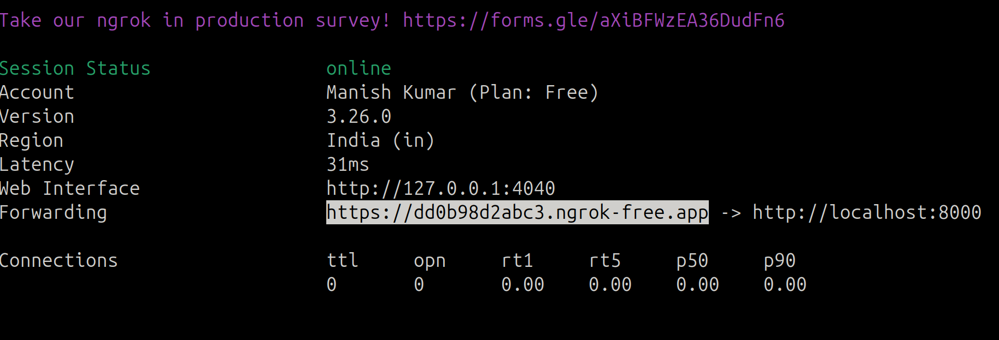
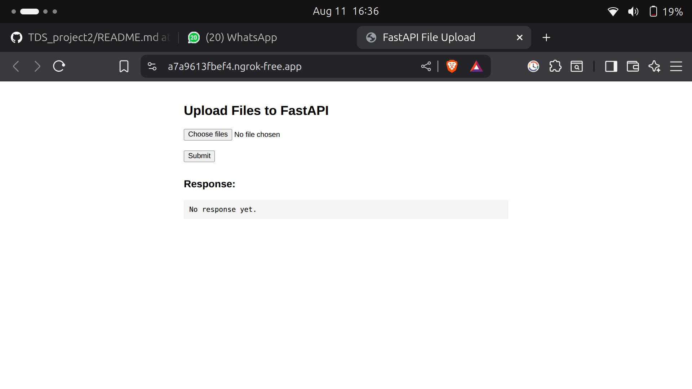
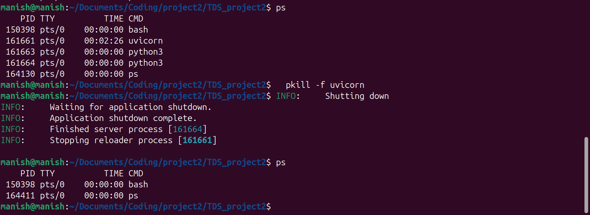

# Read this file everything will happen on its own.

# [Video of Installation](https://drive.google.com/file/d/1BoTTEmpH7XLz9uVZnfIlaia6Y-MR8Zqr/view?usp=drive_link)

`Note: try to use linux distro or install WSL(subsystem for linux) on windows.`

## 🚀 Features
- Automatically installs dependencies from `requirements.txt`
- Installs ngrok if not already installed
- Starts `uvicorn` server
- Exposes your local server publicly via ngrok
- Clean shutdown with **Ctrl+C**
---

## 📦 Prerequisites
Make sure you have:
- **Python 3.8+** installed
- **pip** installed

---


## 🔑 Getting Credentials
1. **Google API Key**  
   Get your key here:  
   [https://aistudio.google.com/apikey](https://aistudio.google.com/apikey)

2. **ngrok Auth Token**  
   Register and get your token here:  
   [https://ngrok.com/](https://ngrok.com/)

   ## ONLY COPY SELECTED PART
   

---


## 🛠️ Installation: Just execute this file and enter your credentials

### 1. Make the script executable
```bash
chmod +x start.sh
```

### 2. Then run the script 
```bash
./start.sh
```


---

# Lastly copy paste the public url
Also don't forgot to add "/api" after the url.

- ### public link

eg: https://dd0b98d2abc3.ngrok-free.app


- ### Add "/api"

## Final link: public link + "/api"

eg:  https://dd0b98d2abc3.ngrok-free.app/api

`Note: This url will be different every time you restart the server. so use below method to get a static url.`

# Static Url
- Go to this(https://dashboard.ngrok.com/domains) website and claim you free static url.

- and after that modify the start.sh file's last line. like this

- Before


- After 


## Environment Variables Setup

This project loads environment variables from a file named `env_variables.txt` located in the project root.

**How to use:**

1. Create a file called `env_variables.txt` in the project directory.
2. Add your variables in the format:
   ```
   GENAI_API_KEY=your_google_api_key
   NGROK_AUTHTOKEN=your_ngrok_authtoken
   # You can add more variables as needed
   ```
3. When you run `start.sh`, these variables will be automatically loaded and exported to your environment.


# Testing
## 🌐 Using the Frontend

A simple HTML frontend is provided for uploading multiple files and viewing API responses.

### How to use:

1. Make sure your FastAPI server is running and accessible (e.g., via ngrok).
2. Open `https://xxxxxx.ngrok-free.app` in your browser.
3. Click the "Choose Files" button and select one or more files.
4. Click "Submit" to upload the files(you can select multiple files) to the backend.
5. The response from the API will be displayed below the form.



**Note:**  
- The frontend sends files to the `/api` endpoint of your public URL.
- You can preview selected file names before uploading.

---

### Troubleshooting

- If you see "No response yet" or an error, check that your FastAPI server is running and accessible.
- Make sure the public URL matches your ngrok tunnel and ends with `/api` for direct API


# Common Issues

1. ### Uvicorn Server Shutdown Issues

**Note:**  
Sometimes, pressing **Ctrl+C** does not fully stop the Uvicorn server. This can lead to "Internal Server Error" or port conflicts when you try to restart the server.

**What to do:**  
- If you still see errors after stopping the script, manually kill any running Uvicorn processes:
  ```bash
  pkill -f uvicorn
  ```
- Alternatively, you can restart your terminal or system to ensure all processes are stopped.

**Tip:**  
Always make sure no old Uvicorn processes are running before starting the


